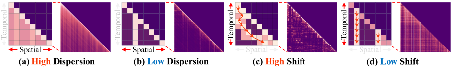
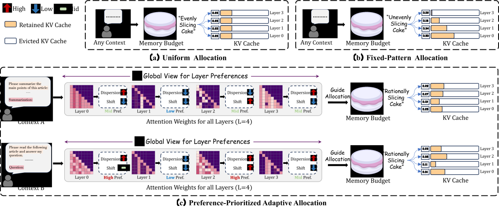

# [ICLR 2025] CAKE: Cascading and Adaptive KV Cache Eviction with Layer Preferences

**This is the official implementation of the paper** CAKE: Cascading and Adaptive KV Cache Eviction with Layer Preferences.

We conduct extensive experiments to evaluate CAKE's ability to retain accuracy and improve performance on long context LLM generation under limited cache sizes.

# Introduction

Large language models (LLMs)' proficiency in handling long sequences boosts Key-value (KV) caching demand. Recent efforts to evict KV cache have alleviated the inference burden, but they often fail to allocate resources rationally across layers with different attention patterns. In this paper, we introduce **C**ascading and **A**daptive **K**V cache **E**viction (**CAKE**), a method that significantly improves LLM inference efficiency by optimizing KV cache eviction through an adaptive cache allocation strategy implemented via a cascading cache management and an innovative eviction indicator.


*Variation in spatial (a, b) and temporal (c, d) characteristics of attention patterns. We
provide toy examples (left) and real examples from Mistral’s different layers (right) for illustration.* 

We approach KV cache eviction as a "cake-slicing problem," assessing each layer's KV cache needs by considering attention dynamics in both spatial and temporal dimensions. During prompt prefilling, CAKE allocates rational cache size for layers by analyzing layer-specific KV cache preferences and manages the memory budgets with the guidance of these preferences in a cascading manner. This approach allows for a global view of cache size allocation, distributing resources adaptively based on the diverse attention mechanisms across layers.

Also, we've designed a new eviction indicator that considers the shifting importance of tokens over time, addressing a limitation in existing methods that often overlook temporal dynamics. Our comprehensive experiments on the LongBench and NeedleBench datasets show that CAKE is capable of preserving the performance of models when retaining only 3.2% KV cache and consistently outperforms current baselines across various models and memory constraints, especially in low-memory situations.


*Illustration of How CAKE Adaptively Makes Cache Allocation* 

<!-- # News -->

# Quick Start

## Requirements

Currently tested with `transformers==4.43.3`, need to check if it is compatible with higher version.

## Installation

```
git clone https://github.com/antgroup/cakekv.git
cd cakekv
bash install.sh
```

## Run LongBench Evaluation


Run prediction using CAKE compression (use `Llama3.1-8b-128k` as an example):
```
python experiments/LongBench/pred_cake.py \
    --model llama3.1-8b-128k \
    --compress --cascading \
    --pred_name pred_result --device 0 \ 
    --cache_size 1024 \
    --window_size 32
```

Run evaluation:
```
python experiments/LongBench/eval.py \
    --model llama3.1-8b-128k \
    --cache_size 1024 \
    --eval_avg  \
    --dir_path pred_result
```

# Citation

If you find CAKE or this project is helpful, please kindly consider cite our paper 😊.

```
@inproceedings{
qin2025cake,
title={{CAKE}: Cascading and Adaptive {KV} Cache Eviction with Layer Preferences},
author={Ziran Qin and Yuchen Cao and Mingbao Lin and Wen Hu and Shixuan Fan and Ke Cheng and Weiyao Lin and Jianguo Li},
booktitle={The Thirteenth International Conference on Learning Representations},
year={2025},
url={https://openreview.net/forum?id=EQgEMAD4kv}
}
```
